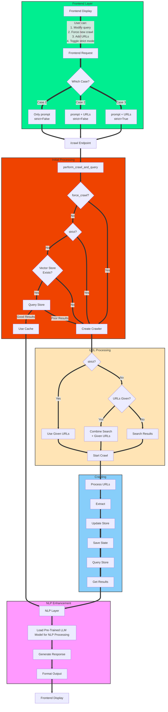

# COMP3071_Designing_Intelligent_Agents
Coursework Repository for the module COMP3071 - Designing Intelligent Agents.

Topic Chosen: Intelligent Web Crawling Agent

### Workflow Diagram:

```mermaid
flowchart TD
    subgraph Frontend["Frontend Layer"]
        F1[Frontend Request] --> F2{Which Case?}
        F2 -->|Case 1| A1[Only prompt
        strict=False]
        F2 -->|Case 2| A2[prompt + URLs
        strict=False]
        F2 -->|Case 3| A3[prompt + URLs
        strict=True]

        FrontendDisplay[Frontend Display] -->|User can:
        1. Modify query
        2. Force new crawl
        3. Add URLs
        4. Toggle strict mode| F1
    end

    A1 & A2 & A3 --> API["/crawl Endpoint"]
    API --> PCQ[perform_crawl_and_query]

    subgraph CrawlQuery["Initial Processing"]
        PCQ --> B{force_crawl?}
        B -->|No| C{strict?}
        B -->|Yes| F[Create Crawler]
        C -->|No| D{Vector Store
        Exists?}
        C -->|Yes| F
        D -->|Yes| E[Query Store]
        D -->|No| F
        E -->|Good Results| Z[Use Cache]
        E -->|Poor Results| F
    end

    subgraph URLProcess["URL Processing"]
        F --> G{strict?}
        G -->|Yes| H[Use Given URLs]
        G -->|No| I{URLs Given?}
        I -->|Yes| J[Combine Search
        + Given URLs]
        I -->|No| K[Search Results]
        H & J & K --> L[Start Crawl]
    end

    subgraph Crawl["Crawling"]
        L --> M[Process URLs]
        M --> N[Extract]
        N --> O[Update Store]
        O --> P[Save State]
        P --> Q[Query Store]
        Q --> R[Get Results]
    end

    Z --> NLP[NLP Layer]
    R --> NLP

    subgraph NLPProcess["NLP Enhancement"]
        NLP --> NLP1[Load Pre-Trained LLM Model for NLP Processing]
        NLP1 --> NLP2[Generate Response]
        NLP2 --> NLP3[Format Output]
    end

    NLP3 --> Display[Frontend Display]

    style Frontend fill:#00EE90,stroke:#333,stroke-width:2px
    style NLPProcess fill:#f9f,stroke:#333,stroke-width:2px
    style Crawl fill:#87CEFA,stroke:#333,stroke-width:2px
    style URLProcess fill:#FFE4B5,stroke:#333,stroke-width:2px
    style CrawlQuery fill:#EF4300,stroke:#333,stroke-width:2px

    %% Thicken all arrows
    linkStyle default stroke-width:5px
    %% Make main flow arrows even thicker
    linkStyle 0,1,2,3,4,29,30,31 stroke-width:7px
```